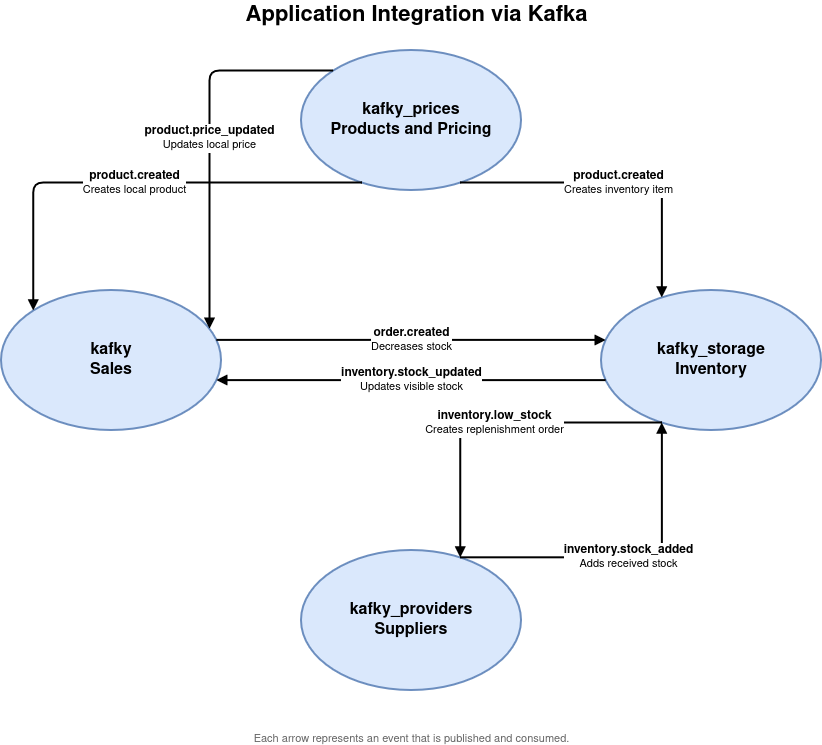

# Kafky Integration Orchestrator

This repository orchestrates and documents a small distributed system built
around Kafka. It is the shared place for integration notes, architecture
planning, and scripts that start or stop the local environment. The documents
in this repository describe how the applications exchange events through
Kafka.

## Required Repositories

Add the following repositories as direct subdirectories of this repository:

```text
kafky/
kafky_kafka/
kafky_prices/
kafky_storage/
kafky_providers/
```

`kafky`, `kafky_prices`, `kafky_storage`, and `kafky_providers` are Rails 8
applications that use Ruby 3.4.3. Each application has its own local SQLite
database.

`kafky_kafka` contains the Docker Compose configuration used to run the local
Kafka broker and Kafka UI.

## System Overview

Kafky is a distributed system composed of applications with separate
responsibilities that communicate through Kafka events:

- `kafky` is the product sales application. It informs the other applications
  when a customer order is created, and keeps its local catalog current by
  reading product and price changes from `kafky_prices` and stock updates from
  `kafky_storage`.
- `kafky_prices` is the source of truth for products and prices. It informs
  the other applications when products are created or their prices change. It
  does not currently consume messages from other applications.
- `kafky_storage` is the source of truth for inventory. It informs the sales
  application about stock changes and alerts providers when stock becomes low.
  It reads product data from `kafky_prices`, customer orders from `kafky`, and
  replenishment deliveries from `kafky_providers`.
- `kafky_providers` manages suppliers and replenishment purchase orders. It
  reads low-stock alerts from `kafky_storage` and informs it when a supplier
  delivery should increase inventory.



This is intentionally a high-level summary. Refer to the integration and
planning documents in this repository for event contracts, application flows,
and implementation details.

## Local Scripts

These scripts are specific to the author's local development environment and
are not general-purpose setup tools. They may require adjustments to work on
other machines, including terminal emulator, RVM, Java, Docker, and `sudo`
configuration.

Start Kafka with visible Docker Compose output:

```bash
./start_kafka.sh
```

Start the Rails and Karafka processes in two terminal windows with tmux panes:

```bash
./start_kafky_apps.sh
```

Stop the environment:

```bash
./down_kafky_apps.sh
./down_kafka.sh
```
